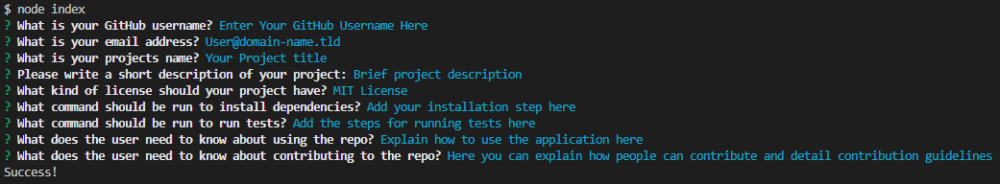

# README Generator

[](https://choosealicense.com/licenses/mit/)
[](https://www.contributor-covenant.org/version/2/1/code_of_conduct/)

## Description
A command line utility that produces a professional, high quality README file from the answers to a series of user input prompts.

[Download Application](https://github.com/trunten/ubbc-readme-generator/archive/refs/heads/main.zip)

### User Story
- As a developer, I want a README generator so that I can quickly create a professional README for a new project

### Acceptance Criteria

* Create a command-line application that accepts user input.
* When a user is prompted for information about the application repository then a high-quality, professional README.md is generated with:
    * The title of the project 
    * Sections entitled Description, Table of Contents, Installation, Usage,  License, Contributing, Tests, and Questions
* When a user enters the project title then it is displayed as the title of the README
* When a user enters a description, installation instructions, usage information, contribution guidelines, and test instructions then this information is added to the sections of the README entitled Description, Installation, Usage, Contributing, and Tests
* When a user chooses a license for their application from a list of options then a badge for that license is added near the top of the README and a notice is added to the section of the README entitled **License** that explains which license the application is covered under
* When a user enters their GitHub username then this is added to the section of the README entitled **Questions**, with a link to their GitHub profile
* When a user enters their email address then this is added to the section of the README entitled **Questions**, with instructions on how to reach them with additional questions
* When a user clicks on the links in the **Table of Contents** then they are taken to the corresponding section of the README

## Table of contents
- [Installation](#installation)
- [Usage](#usage)
- [Credits](#credits)
- [Contributing](#contributing)
- [License](#license)
- [Video Guide](#video)

## Installation
- Open your terminal and navigate to the aplication's containing folder
- Type the following command into your terminal to install application dependancies:
 ```npm i```

## Usage
- Install project dependancies using the command detailed in the [installation](#installation) section
- Run the application by typing <code>node index.js</code> into your terminal
- Answer the questions presented by typing your response in the terminal
-Your <code>README.md</code> file will be output to the sub-folder <code>generated_readme</code> 


## Credits
- Markdown mailto links: https://www.w3schools.io/file/markdown-links

## Contributing
Pull requests are welcome. For major changes, please open an issue first to discuss what you would like to change.

This repo adopts the [Contributor Covenant](https://www.contributor-covenant.org/version/2/1/code_of_conduct/) for contributing guidlines.

## Questions
- Github Profile: [trunten](https://github.com/trunten)
- Contact me for any questions you may have via email at [trunten@btinternet.com](mailto:trunten@btinternet.com)

## License
[](https://choosealicense.com/licenses/mit/)

This project is licensed under the [MIT License](https://choosealicense.com/licenses/mit/)

Refer to the [license](LICENSE) in the repo

## Video
[[ Download Full quality video (98mb) ]](./assets/videos/Video%20Guide.mp4?raw=true)

https://user-images.githubusercontent.com/4108334/221923557-f3941550-e925-48fc-a1a2-dd24989387bb.mp4


